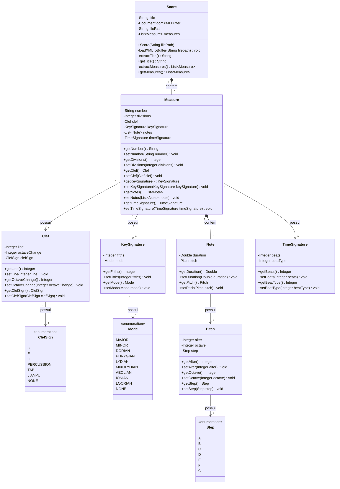

```mermaid
classDiagram
class Score {
-String title
-Document domXMLBuffer
-String filePath
-List~Measure~ measures
+Score(String filePath)
-loadXMLToBuffer(String filepath) void
-extractTitle() String
+getTitle() String
-extractMeasures() List~Measure~
+getMeasures() List~Measure~
}

    class Measure {
        -String number
        -Integer divisions
        -Clef clef
        -KeySignature keySignature
        -List~Note~ notes
        -TimeSignature timeSignature
        +getNumber() String
        +setNumber(String number) void
        +getDivisions() Integer
        +setDivisions(Integer divisions) void
        +getClef() Clef
        +setClef(Clef clef) void
        +getKeySignature() KeySignature
        +setKeySignature(KeySignature keySignature) void
        +getNotes() List~Note~
        +setNotes(List~Note~ notes) void
        +getTimeSignature() TimeSignature
        +setTimeSignature(TimeSignature timeSignature) void
    }

    class Clef {
        -Integer line
        -Integer octaveChange
        -ClefSign clefSign
        +getLine() Integer
        +setLine(Integer line) void
        +getOctaveChange() Integer
        +setOctaveChange(Integer octaveChange) void
        +getClefSign() ClefSign
        +setClefSign(ClefSign clefSign) void
    }

    class ClefSign {
        <<enumeration>>
        G
        F
        C
        PERCUSSION
        TAB
        JIANPU
        NONE
    }

    class KeySignature {
        -Integer fifths
        -Mode mode
        +getFifths() Integer
        +setFifths(Integer fifths) void
        +getMode() Mode
        +setMode(Mode mode) void
    }

    class Mode {
        <<enumeration>>
        MAJOR
        MINOR
        DORIAN
        PHRYGIAN
        LYDIAN
        MIXOLYDIAN
        AEOLIAN
        IONIAN
        LOCRIAN
        NONE
    }

    class Note {
        -Double duration
        -Pitch pitch
        +getDuration() Double
        +setDuration(Double duration) void
        +getPitch() Pitch
        +setPitch(Pitch pitch) void
    }

    class Pitch {
        -Integer alter
        -Integer octave
        -Step step
        +getAlter() Integer
        +setAlter(Integer alter) void
        +getOctave() Integer
        +setOctave(Integer octave) void
        +getStep() Step
        +setStep(Step step) void
    }

    class Step {
        <<enumeration>>
        A
        B
        C
        D
        E
        F
        G
    }

    class TimeSignature {
        -Integer beats
        -Integer beatType
        +getBeats() Integer
        +setBeats(Integer beats) void
        +getBeatType() Integer
        +setBeatType(Integer beatType) void
    }

    Score "1" *-- "*" Measure : contém
    Measure "*" --> "1" Clef : possui
    Measure "*" --> "1" KeySignature : possui
    Measure "1" *-- "*" Note : contém
    Measure "*" --> "1" TimeSignature : possui
    Note "*" --> "1" Pitch : possui
    Pitch "*" --> "1" Step : possui
    KeySignature "*" --> "1" Mode : possui
    Clef "*" --> "1" ClefSign : possui
```